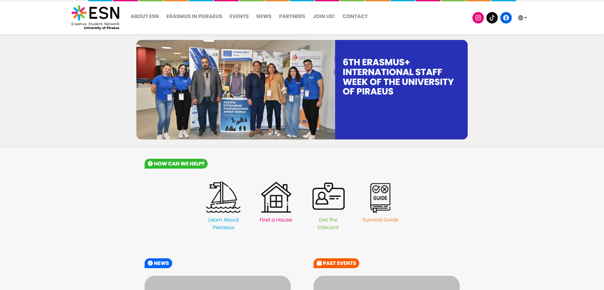
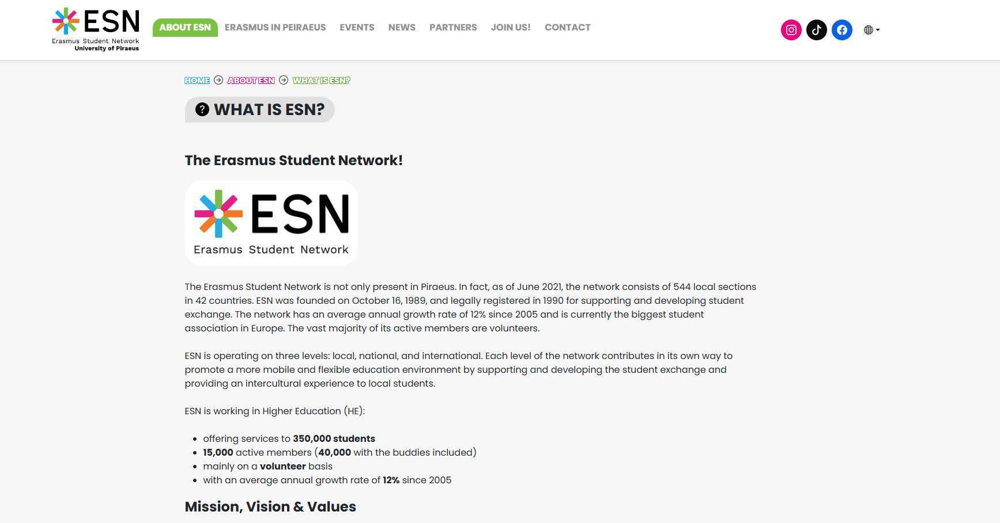
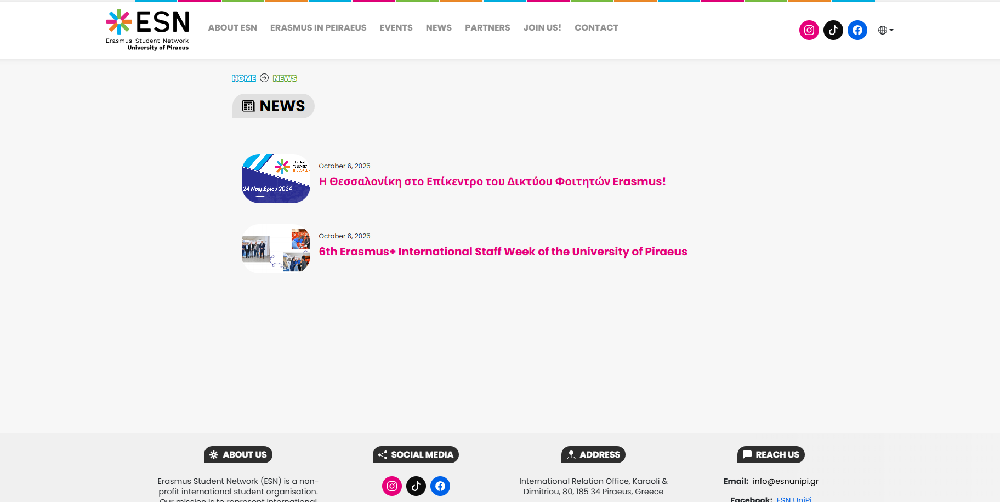
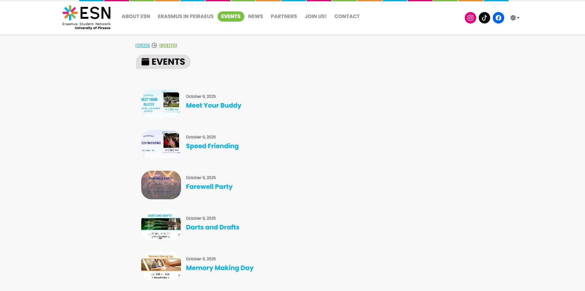
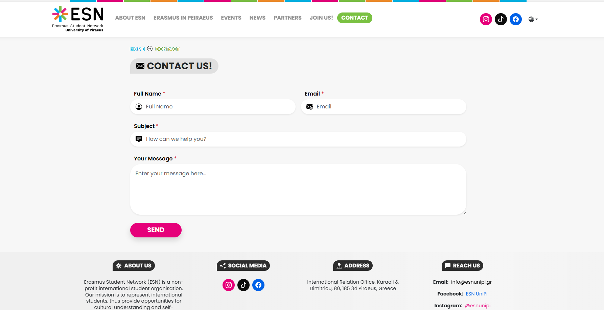
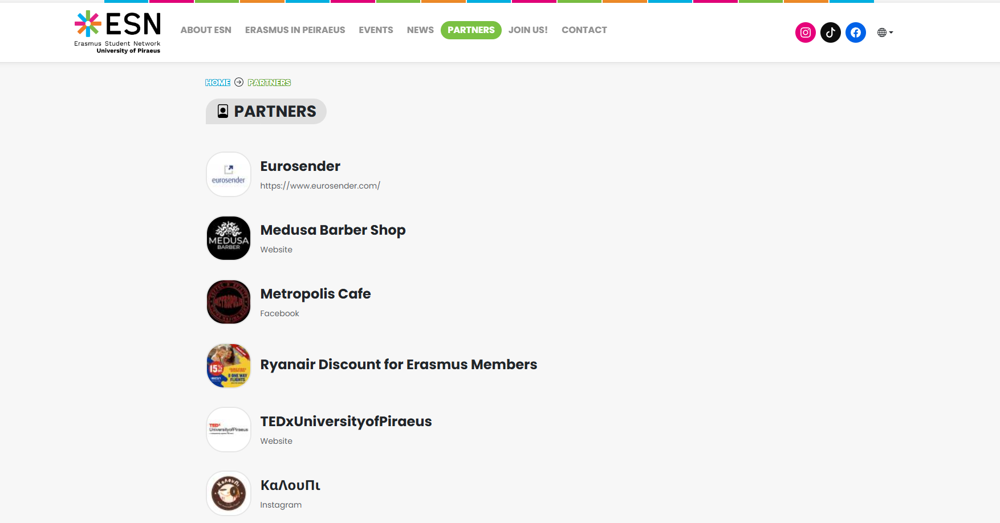
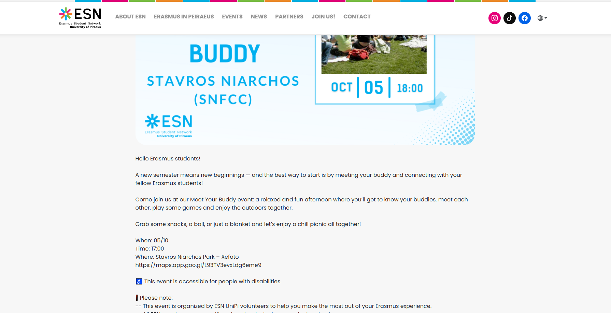

<h1 align="center">ESN UniPi Portal</h1>
<h3 align="center">Centralized Hub for International Students @ University of Piraeus</h3>

<p align="center">
  A dedicated web portal for the <strong>Erasmus Student Network (ESN)</strong> at the University of Piraeus (UniPi). This application serves as a centralized hub for international students, streamlining information access and community engagement through a modern, responsive interface.
</p>

<p align="center">
  <a href="https://esn-unipi-12345.netlify.app/">
    
  </a>
  <a href="https://opensource.org/licenses/MIT">
    
  </a>
</p>

---

### ✨ Core Features

* **International Community Hub:** Tailored information delivery structures designed to guide Erasmus students seamlessly through essential local university workflows and social resource ecosystems.
* **Structured Information Architecture:** Intuitive content hierarchies mapping ESN localized services, real-time dynamic event calendars, and academic networking resources.
* **Fluid Multi-Device Responsiveness:** Engineered with an adaptive viewport strategy, ensuring seamless functionality across mobile and desktop environments for students on the move.
* **High-End UI/UX Ecosystem:** Clean, modern production layout matching formal corporate identity assets with a heavy emphasis on accessible data visibility and contrast.

---

### 🛠️ Tech Stack

**Frontend Logic & Framework**
<p align="left">
  
  
  
</p>

**Design Layout & Presentation**
<p align="left">
  
  
  
</p>

---

### 📸 Application Showcase

<p align="center">
  
  
</p>
<p align="center">
  
  
</p>
<p align="center">
  
  
</p>
<p align="center">
  
</p>

---

### 🚀 Getting Started

**1. Clone the repository:**
```bash
git clone https://github.com/filipposobrijanu/esn-frontend.git
cd esn-frontend
```

**2. Install dependencies:**
```bash
npm install
```

**3. Start the local development server:**
```bash
npm start
```
